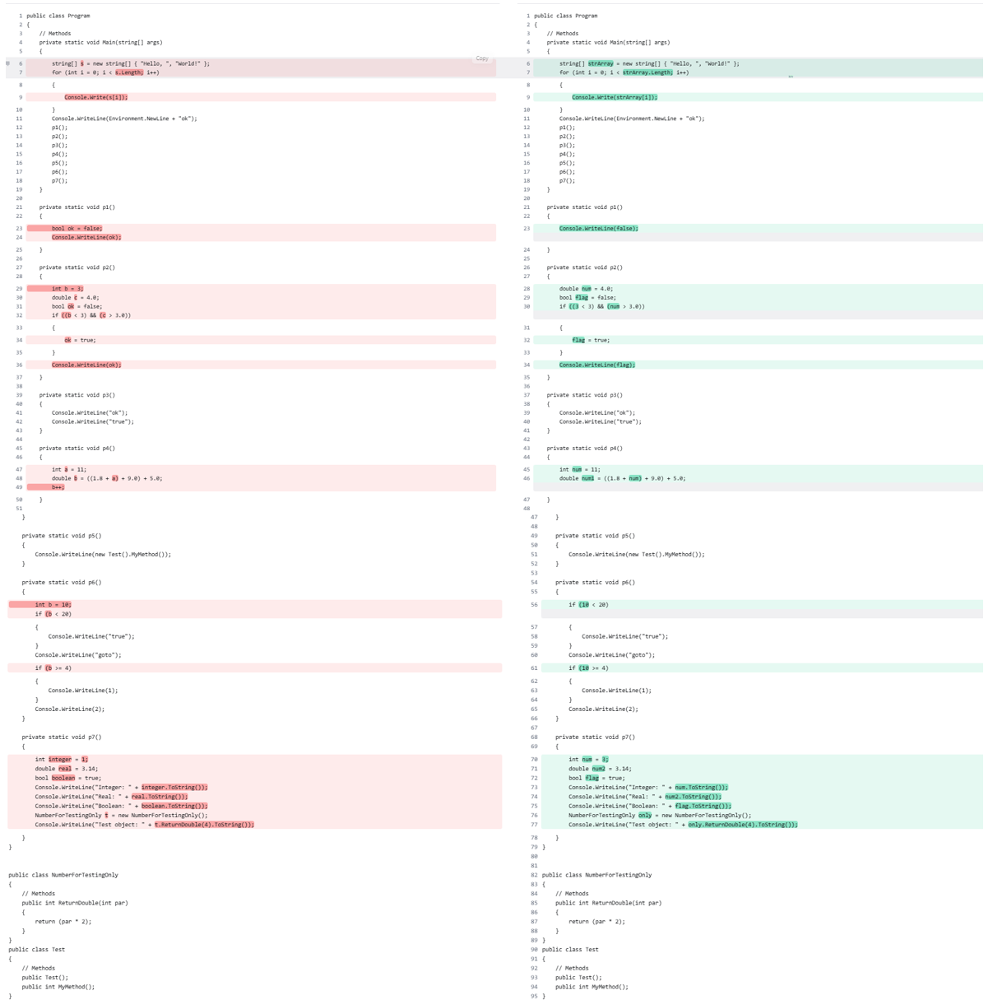
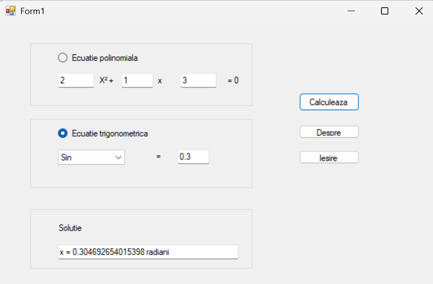

# Labs – Software Engineering

---

## 📂 Lab 1

### 📖 Description
Introduction to basic C# concepts, including classes, interfaces and fundamental code structures.
In this lab, I explored object-oriented programming principles in C#, focusing on defining classes, implementing interfaces, and understanding how they interact within a simple application.
Additionally, I worked with Dotfuscator for code obfuscation, performed code disassembly, and used a .NET reflector tool to analyze compiled assemblies.

### 🖼️ Screenshot
 

---

## 📂 Lab 2

### 📖 Description
The application provides a graphical user interface (GUI) to solve two primary types of equations:
* Polynomial Equations: Handles 1st and 2nd-degree equations by calculating roots based on user-provided coefficients ($x^2, x^1, x^0$).
* Trigonometric Equations: Solves basic equations such as $\sin(x) = a$, $\cos(x) = a$, and $\tan(x) = a$

### 🖼️ Screenshot
 

---