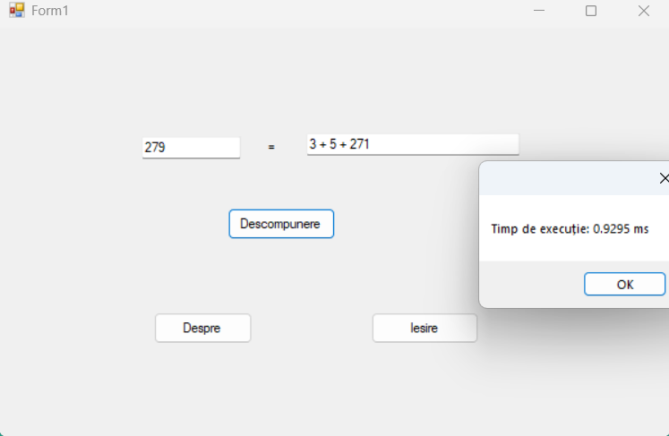
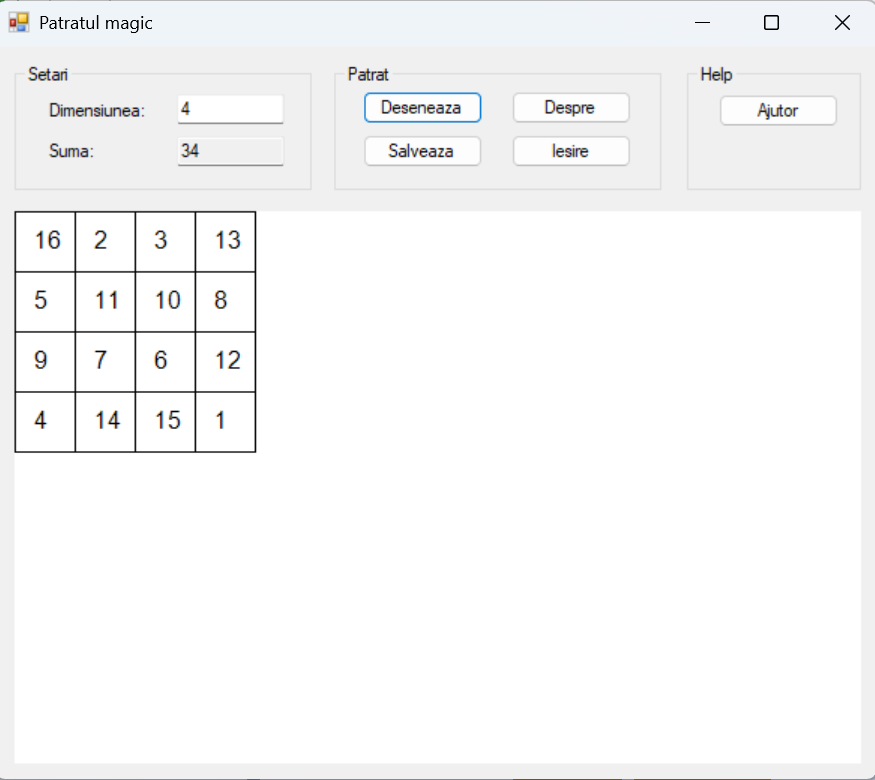
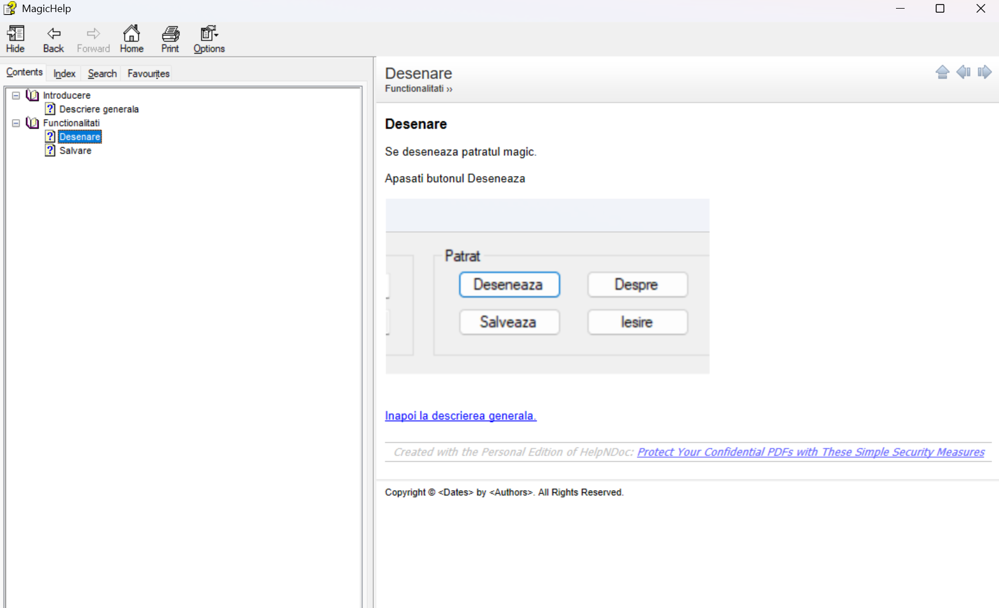
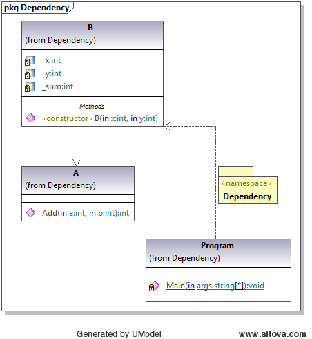
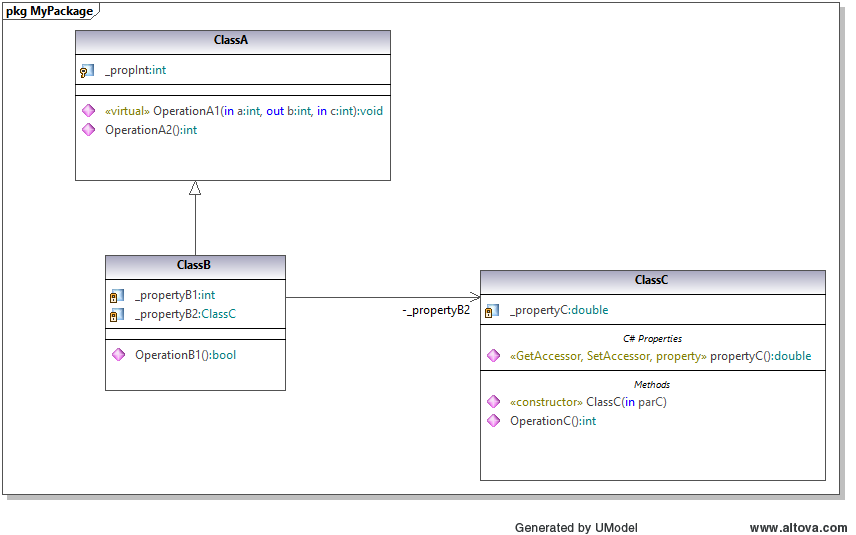
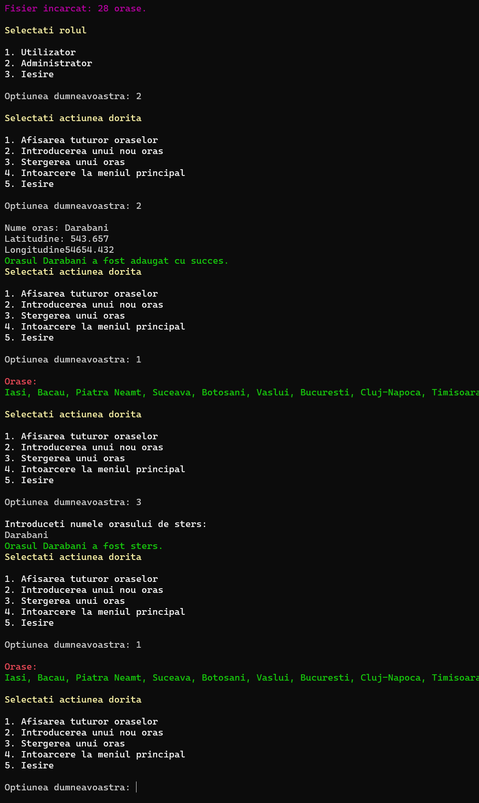

# Labs – Software Engineering

---

## 📂 Lab 1

### 📖 Description
In this lab, I explored object-oriented programming principles in C#, focusing on defining classes, implementing interfaces, and understanding how they interact within a simple application.
* Additionally, I worked with Dotfuscator for code obfuscation, performed code disassembly, and used a .NET reflector tool to analyze compiled assemblies.

### 🖼️ Screenshot
 

---

## 📂 Lab 2

### 📖 Description
The application provides a graphical user interface (GUI) to solve two primary types of equations:
* Polynomial Equations: Handles 1st and 2nd-degree equations by calculating roots based on user-provided coefficients ($x^2, x^1, x^0$).
* Trigonometric Equations: Solves basic equations such as $\sin(x) = a$, $\cos(x) = a$, and $\tan(x) = a$

### 🖼️ Screenshot
 

---
## 📂 Lab 3

### 📖 Description
This application implements a C# Class Library (Prim.dll) to handle prime number logic and demonstrates the difference between static and dynamic linking.

* Prime Logic: Efficiently verifies primality and performs decomposition for even and odd numbers.

* Dynamic Linking: Loads the DLL at runtime using System.Reflection for modularity.

* Performance: Optimized algorithms designed to execute complex decompositions in under 1 second.

### 🖼️ Screenshot
 

---
## 📂 Lab 4

### 📖 Description
This application focuses on project documentation, featuring a C# implementation of a Magic Square generator and the integration of automated help systems.
* Magic Square Logic: Utilizes a dedicated class, MagicBuilder, to calculate and generate magic squares of any size (odd, singly even, or doubly even).
* Dynamic Graphics: Implements a Windows Forms interface to visually draw the generated matrix using System.Drawing, including grid lines and numeric values. * Documentation Systems: User Help: Includes a compiled help file (.chm) created with HelpNDoc for end-user guidance, accessible directly from the application's interface.
     * API Documentation: Features automated developer documentation generated with Doxygen based on triple-slash (///) XML code comments and structured file headers.
* File Management: Provides functionality to save the generated magic square as an image file (PNG, BMP, JPG, or GIF) using a SaveFileDialog

### 🖼️ Screenshot
  
 

## 📂 Lab 5

### 📖 Description
This laboratory focuses on the practical application of **Unified Modeling Language (UML)** through the use of **Altova UModel**, specifically exploring the synchronization between visual models and C# source code.

* **Code Engineering**:
    * **Forward Engineering**: Involves creating a class diagram within a dedicated package set as a C# Namespace Root to generate functional C# source files.
    * **Reverse Engineering**: Utilizes the software's import functionality to automatically generate class diagrams from existing Visual Studio C# projects or source directories.
* **Diagram Drawing & Design**:
    * **Structural Diagrams**: Includes the manual construction of complex Class Diagrams featuring advanced relationships like dependency, aggregation, composition, and associations with specific multiplicities.
    * **Behavioral Diagrams**: Features the creation of Use Case diagrams to model actor interactions, Activity diagrams with decisions and partitions (swimlanes), and Sequence diagrams to visualize object lifelines and messages.
    * **OOP Representation**: Implements visual notations for specialized object-oriented concepts, including abstract classes, interfaces, static members, and method overrides.
* **Project Documentation**: Includes the export of all designed diagrams as image files (PNG/JPG) for comprehensive technical documentation.

### 🖼️ Screenshot
  

## 📂 Lab 6
### 📖 Description
This project implements the **Model-View-Presenter (MVP)** architectural pattern to build a robust **Transport Information System**. It focuses on strict decoupling of business logic from the user interface, allowing for both Console and Windows Forms front-ends using the same core logic.

* **MVP Architecture**: Implements a **Passive View** pattern where the `Presenter` acts as the orchestrator, the `Model` manages the `cities.txt` database, and the `View` remains a thin UI layer.
* **Geospatial Logic**: Features the **Haversine Formula** to calculate real-world distances (km) between cities based on latitude and longitude coordinates.
* **Decoupled Design**: Utilization of **Interface-Based Programming** (`IModel`, `IView`, `IPresenter`) to ensure the system is highly testable and UI-independent.
* **Dynamic UI Systems**: 
    * **CLI**: A state-driven hierarchical menu system using `Enums` and `Structs` for a professional console experience.
    * **GUI**: Support for **Windows Forms** implementation sharing the exact same Presenter/Model components.
* **Data Persistence**: Efficient file I/O management with `StreamReader/Writer` and `CultureInfo` handling for precise coordinate parsing.

### 🖼️ Screenshot
  

