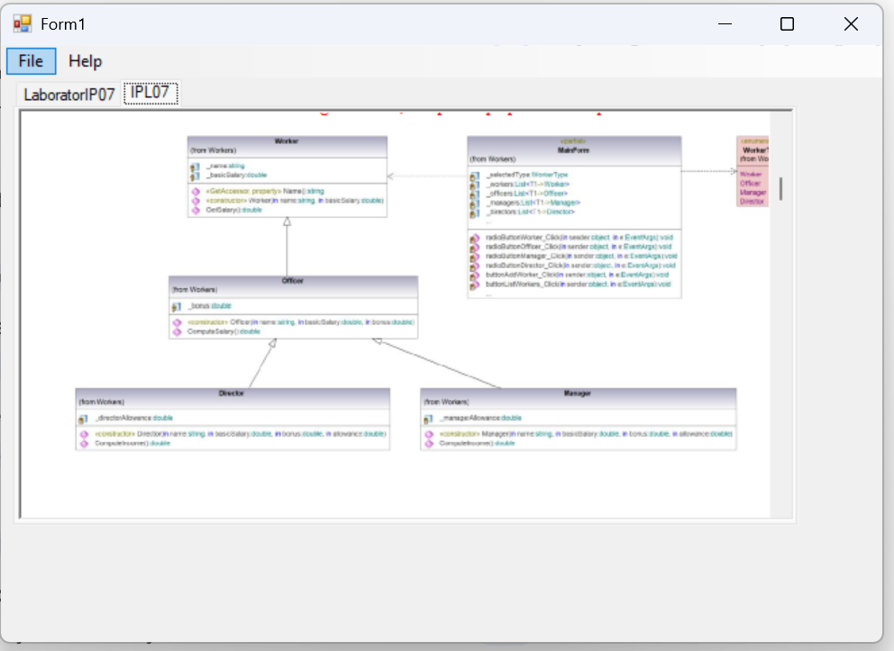
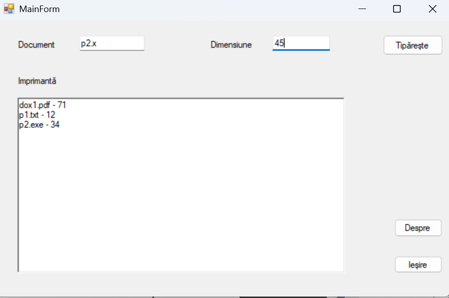
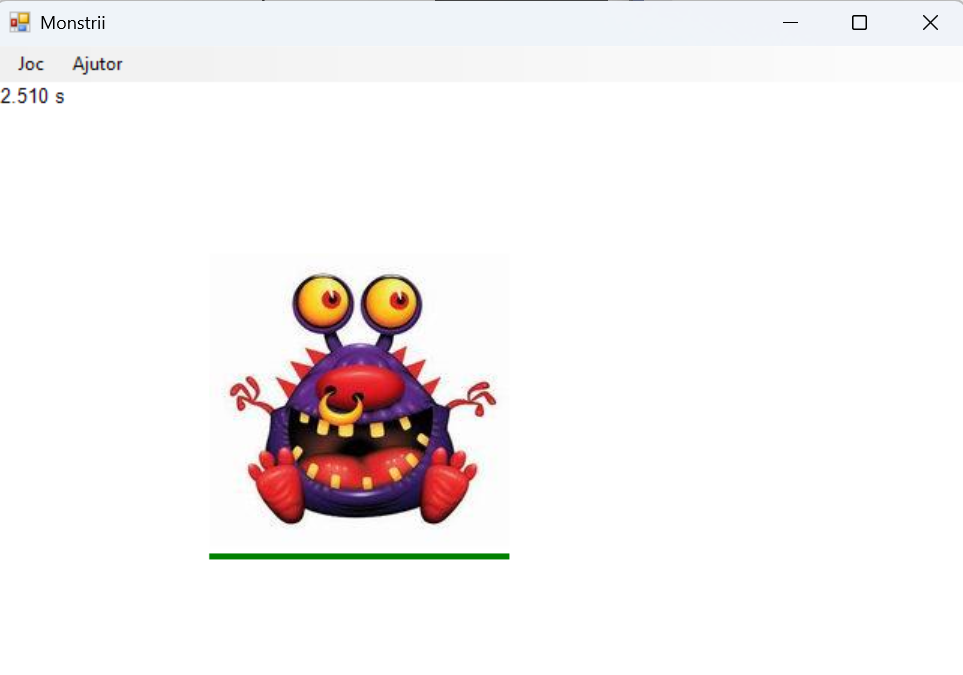
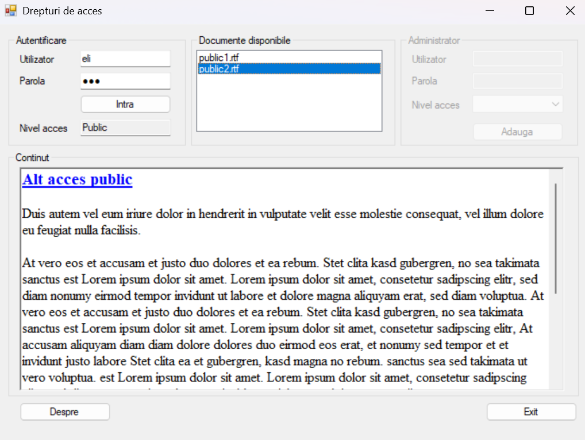
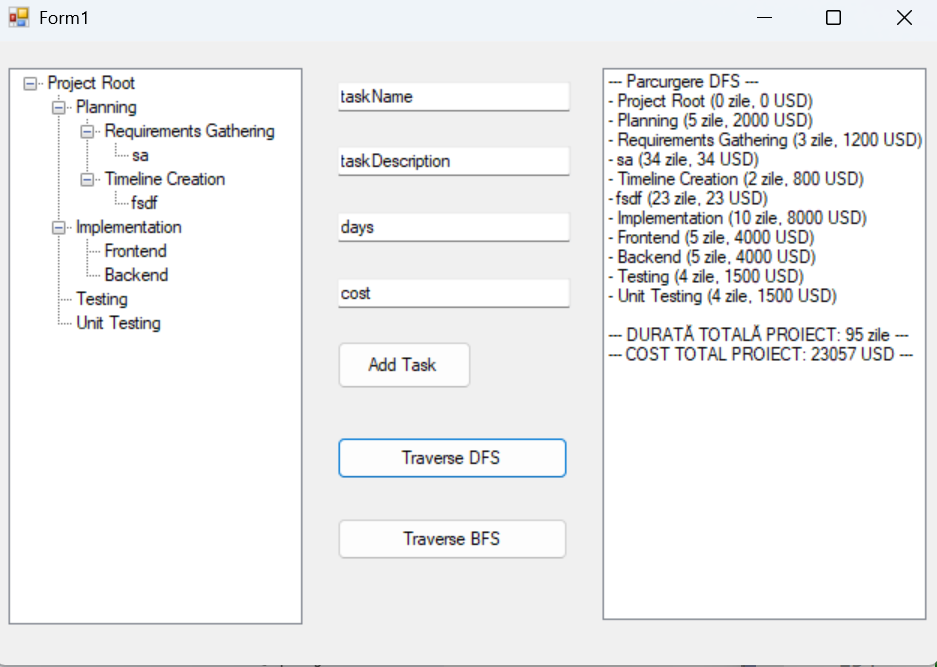
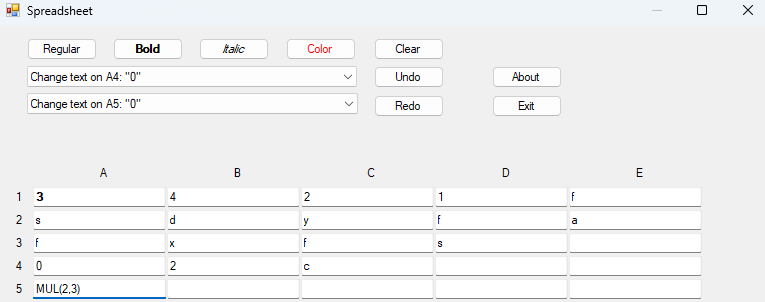

# Labs – Software Engineering

---

## 📂 Lab 1

### 📖 Description
In this lab, I explored object-oriented programming principles in C#, focusing on defining classes, implementing interfaces, and understanding how they interact within a simple application.
* Additionally, I worked with Dotfuscator for code obfuscation, performed code disassembly, and used a .NET reflector tool to analyze compiled assemblies.

### 🖼️ Screenshot
 

---

## 📂 Lab 2

### 📖 Description
The application provides a graphical user interface (GUI) to solve two primary types of equations:
* Polynomial Equations: Handles 1st and 2nd-degree equations by calculating roots based on user-provided coefficients ($x^2, x^1, x^0$).
* Trigonometric Equations: Solves basic equations such as $\sin(x) = a$, $\cos(x) = a$, and $\tan(x) = a$

### 🖼️ Screenshot
 

---
## 📂 Lab 3

### 📖 Description
This application implements a C# Class Library (Prim.dll) to handle prime number logic and demonstrates the difference between static and dynamic linking.

* Prime Logic: Efficiently verifies primality and performs decomposition for even and odd numbers.

* Dynamic Linking: Loads the DLL at runtime using System.Reflection for modularity.

* Performance: Optimized algorithms designed to execute complex decompositions in under 1 second.

### 🖼️ Screenshot
 

---
## 📂 Lab 4

### 📖 Description
This application focuses on project documentation, featuring a C# implementation of a Magic Square generator and the integration of automated help systems.
* Magic Square Logic: Utilizes a dedicated class, MagicBuilder, to calculate and generate magic squares of any size (odd, singly even, or doubly even).
* Dynamic Graphics: Implements a Windows Forms interface to visually draw the generated matrix using System.Drawing, including grid lines and numeric values. * Documentation Systems: User Help: Includes a compiled help file (.chm) created with HelpNDoc for end-user guidance, accessible directly from the application's interface.
     * API Documentation: Features automated developer documentation generated with Doxygen based on triple-slash (///) XML code comments and structured file headers.
* File Management: Provides functionality to save the generated magic square as an image file (PNG, BMP, JPG, or GIF) using a SaveFileDialog

### 🖼️ Screenshot
  
 

## 📂 Lab 5

### 📖 Description
This laboratory focuses on the practical application of **Unified Modeling Language (UML)** through the use of **Altova UModel**, specifically exploring the synchronization between visual models and C# source code.

* **Code Engineering**:
    * **Forward Engineering**: Involves creating a class diagram within a dedicated package set as a C# Namespace Root to generate functional C# source files.
    * **Reverse Engineering**: Utilizes the software's import functionality to automatically generate class diagrams from existing Visual Studio C# projects or source directories.
* **Diagram Drawing & Design**:
    * **Structural Diagrams**: Includes the manual construction of complex Class Diagrams featuring advanced relationships like dependency, aggregation, composition, and associations with specific multiplicities.
    * **Behavioral Diagrams**: Features the creation of Use Case diagrams to model actor interactions, Activity diagrams with decisions and partitions (swimlanes), and Sequence diagrams to visualize object lifelines and messages.
    * **OOP Representation**: Implements visual notations for specialized object-oriented concepts, including abstract classes, interfaces, static members, and method overrides.
* **Project Documentation**: Includes the export of all designed diagrams as image files (PNG/JPG) for comprehensive technical documentation.

### 🖼️ Screenshot
  

## 📂 Lab 6
### 📖 Description
This project implements the **Model-View-Presenter (MVP)** architectural pattern to build a robust **Transport Information System**. It focuses on strict decoupling of business logic from the user interface, allowing for both Console and Windows Forms front-ends using the same core logic.

* **MVP Architecture**: Implements a **Passive View** pattern where the `Presenter` acts as the orchestrator, the `Model` manages the `cities.txt` database, and the `View` remains a thin UI layer.
* **Geospatial Logic**: Features the **Haversine Formula** to calculate real-world distances (km) between cities based on latitude and longitude coordinates.
* **Decoupled Design**: Utilization of **Interface-Based Programming** (`IModel`, `IView`, `IPresenter`) to ensure the system is highly testable and UI-independent.
* **Dynamic UI Systems**: 
    * **CLI**: A state-driven hierarchical menu system using `Enums` and `Structs` for a professional console experience.
    * **GUI**: Support for **Windows Forms** implementation sharing the exact same Presenter/Model components.
* **Data Persistence**: Efficient file I/O management with `StreamReader/Writer` and `CultureInfo` handling for precise coordinate parsing.

### 🖼️ Screenshot
  

## 📂 Lab 7
### 📖 Description
This project implements the **Factory Method** design pattern to create a versatile **Document Reader** application. It focuses on decoupling the document creation logic from specific file formats, allowing the system to dynamically generate various page types within a unified interface.

* **Factory Method Pattern**: Implements a creator hierarchy (`Document`) that delegates the instantiation of products (`Page`) to concrete subclasses like `TextDocument` and `GraphicDocument` .
* **Multi-Format Rendering**: Supports diverse file extensions including `.txt`, `.rtf`, `.bmp`, and `.jpg`, with optional support for `.pdf` and `.docx`.
* **Index-Driven Loading**: Automatically populates document pages by parsing index files (`.txd`, `.grd`) using `StreamReader`.
* **Dynamic UI Integration**: Utilizes a `TabControl` to host various Windows Forms controls (`TextBox`, `PictureBox`, etc.) as interactive document pages .
* **Scalable Architecture**: Features a modular folder structure for `Document` and `Pages`, ensuring the system is easily extensible for new file formats .

### 🖼️ Screenshot
  

## 📂 Lab 8
### 📖 Description
This project explores the **Singleton** and **Prototype** creational design patterns through two distinct Windows Forms applications: a centralized printer queue simulation and an optimized monster-shooting game. It focuses on managing shared resources and optimizing performance when creating resource-heavy objects.

* **Singleton Pattern**: Implements a unified `Printer` class to manage a single document queue across the entire application, ensuring only one instance is ever created.
* **Printer Simulation**: Utilizes a `Timer` control to simulate asynchronous document processing based on file size, strictly adhering to a FIFO (First-In, First-Out) queue mechanism.
* **Prototype Pattern**: Optimizes the generation of enemies in a game by cloning a base `MonsterSprite` object, bypassing the costly and time-consuming Artificial Intelligence (`InitAI`) initialization module.
* **Deep Copy Serialization**: Implements robust object cloning using `BinaryFormatter` and `MemoryStream` to duplicate state, requiring the targeted classes to be decorated with the `[Serializable]` attribute.
* **XML Configuration & Deserialization**: Dynamically loads game assets and monster properties (such as images, colors, and lives) by parsing a `settings.xml` configuration file using `XmlSerializer`.

### 🖼️ Screenshots
  
  

## 📂 Lab 9
### 📖 Description
This project implements the Proxy, Composite, and Iterator structural and behavioral design patterns through a secure document management system and a hierarchical project task explorer. It focuses on enforcing access control, securing data transmission, and managing complex object trees.

* **Protection Proxy Pattern**: Uses a ProxyDocumentManager to intercept requests and control access to sensitive files based on user authorization levels.
* **Security & Authentication**: Implements SHA1 password hashing and verifies user credentials against a secure database file.
* **Rijndael Encryption**: Secures document content during simulated transfer between the real manager and the proxy through encryption and decryption.
* **Administrative Module**: Provides a dedicated interface for authorized admins to create and persist new user accounts. 
* **Composite Pattern**: Models a "Project Task Explorer" using a unified interface (`ProjectComponent`). It enables the dynamic construction of nested task trees and performs recursive calculations for total project costs and cumulative durations across all sub-activities.
* **Iterator Strategies (DFS & BFS)**: Features custom iterators to navigate the project tree flexibly. It utilizes a Queue-based approach for BFS (processing project phases level-by-level) and a Stack-based approach for DFS (prioritizing the deep completion of specific sub-task branches).
* **Interactive UI Integration**: Connects the underlying Composite data model to a Windows Forms `TreeView` for clear visual representation . It allows users to dynamically select parent nodes, add new sub-tasks with specific properties, and generate ordered traversal reports directly from the interface.

### 🖼️ Screenshots
  
  

## 📂 Lab 10
### 📖 Description
This project implements the **Command** and **Adapter** design patterns across two distinct applications. It features a functional Spreadsheet simulator with advanced state management and a geometric calculator that unifies incompatible class interfaces.

* **Command Pattern**: Encapsulates user actions into standalone command objects (`ChangeColorCommand`, `ChangeTextCommand`, `ChangeFormatCommand`) using an `Invoker` to manage execution on `ExtendedTextBox` receivers.
* **Undo/Redo System**: Features a robust history management system using command stacks, allowing users to seamlessly undo and redo text, color, and format modifications within the grid.
* **Spreadsheet Engine & Math**: Simulates a Microsoft Excel-like interface with a dynamically generated grid (`TextBoxGrid`) and includes bonus functionality to evaluate basic formulas (`ADD`, `SUB`, `MUL`, `DIV`) between cells.

### 🖼️ Screenshot
  